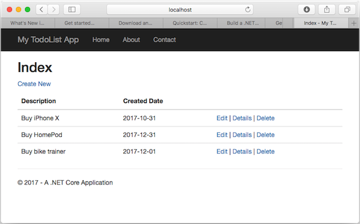
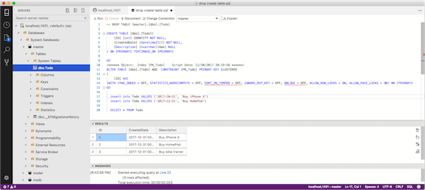

# Docker SQL Server instance on macOS

0. Install Visual Studio for Mac (with ASP.NET Core 2.0)
1. Install Docker
2. Install SQL Server for Linux on Docker
3. Run ASP.NET Core with local SQL back-end!
4. Install SQL Operations Studio for Mac
5. Edit and query data with SOS





## Guides

* [ASP.NET Core on Visual Studio for Mac](https://docs.microsoft.com/en-us/visualstudio/mac/asp-net-core)
* [Build a .NET Core and SQL Database web app in Azure App Service on Linux](https://docs.microsoft.com/en-us/azure/app-service/containers/tutorial-dotnetcore-sqldb-app)
* [Getting Started with EF Core on ASP.NET Core with a New database](https://docs.microsoft.com/en-us/ef/core/get-started/aspnetcore/new-db)
* [Quickstart: Connect and query SQL Server using SQL Operations Studio (preview)](https://docs.microsoft.com/en-us/sql/sql-operations-studio/quickstart-sql-server)
* [Download and install Microsoft SQL Operations Studio (preview)](https://docs.microsoft.com/en-us/sql/sql-operations-studio/download)

### bash

```bash
sudo docker pull microsoft/mssql-server-linux:2017-latest

sudo docker run -e 'ACCEPT_EULA=Y' -e 'MSSQL_SA_PASSWORD=<YourStrong!Passw0rd>' \
   -p 1401:1433 --name sql1 \
   -d microsoft/mssql-server-linux:2017-latest

sudo docker ps -a
```

### Connection String

For both ASP.NET and SQL Operations Studio (warning: using `sa` is not recommended)

```
Server=localhost,1401;Initial Catalog=master;User ID=sa;Password=<YourStrong!Passw0rd>;Persist Security Info=False;
```

## Tools

* [Visual Studio for Mac](https://www.visualstudio.com/vs/)
* [Docker for Mac](https://www.docker.com/docker-mac) [docs](https://docs.docker.com/docker-for-mac/)
* [Run the SQL Server 2017 container image with Docker](https://docs.microsoft.com/en-us/sql/linux/quickstart-install-connect-docker)
* [SQL Operations Studio](https://docs.microsoft.com/en-us/sql/sql-operations-studio/what-is)


## Tips

* [Migrating from ASP.NET Core 1.x to ASP.NET Core 2.0](https://docs.microsoft.com/en-us/aspnet/core/migration/1x-to-2x/)
* [EntityFramework Core – Add an implementation of IDesignTimeDbContextFactory](https://codingblast.com/entityframework-core-idesigntimedbcontextfactory/)


## Related

* [Visual Studio for Mac hands-on labs](https://github.com/Microsoft/vs4mac-labs)


